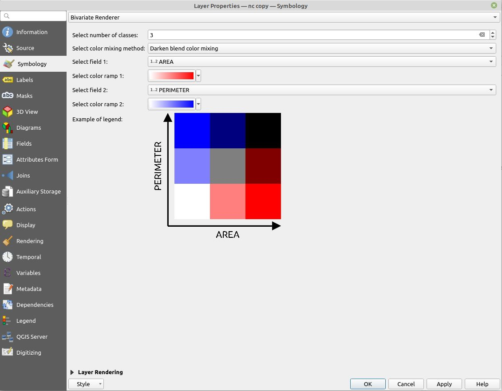

# Color mixing methods

The plugin supports three methods to mixture colors from color ramps. These can be selected in render as **Color mixing method:**. Each of these approaches provide different outcome in the legend. Each method works with different legends and under different circumstances.

The example below show identical color ramps, however, the color mixing option changes the resulting bivariate legend significantly.

## Direct Mixing

## Blend Darken

## Blend Multiply

