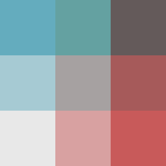
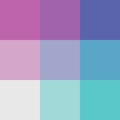
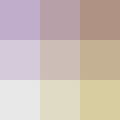
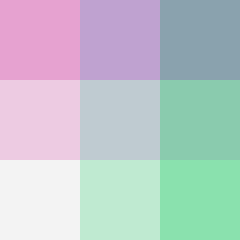
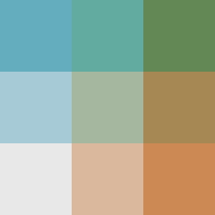

# Color ramps examples

There is couple of bivariate legends prepared directly in the plugin and available from **Predefined color ramps:** option. They are listed here with images and note, about **Color mixing method** that provides best result for them.

## Dark red - Light Blue

- Darken blend color mixing

## Aquamarine - Pink

- Darken blend color mixing

## Blue - Green

- Direct color mixing

## Yellow - Violet

- Direct color mixing

## Green - Pink

- this one kinda works with both although the Darken blend color mixing option is probably better

## Orange - Blue

- Darken blend color mixing

