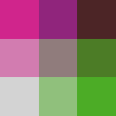

# Color ramps examples

The default color ramps provided by the plugin are extracted from R package [biscale](https://cran.r-project.org/web/packages/biscale) and can be [seen at this vignette](https://cran.r-project.org/web/packages/biscale/vignettes/bivariate_palettes.html).

There is couple of bivariate legends prepared directly in the plugin and available from **Color ramps:** option. These should be tried with different color mixing methods, to find the best one for each bivariate color ramp.

## Examples

Some of these may not look best here, as they are all exported with the **Darken Blend** mixing method, which may not be ideal for every color ramp.

