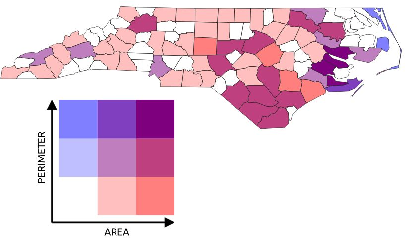
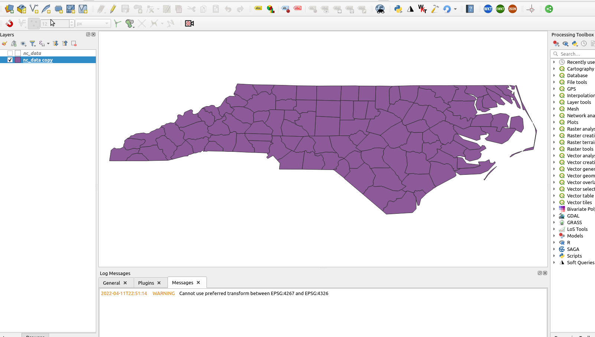
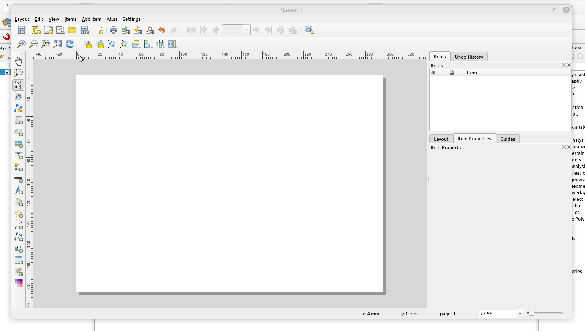

# Bivariate color polygon renderer

Plugin providing bivariate render for [QGIS](https://www.qgis.org/en/site/). Examples of the bivariate visualization can be found in [this article](https://www.joshuastevens.net/cartography/make-a-bivariate-choropleth-map/).

The plugin contains all the necessary python objects to handle creation of bivariate choropleth maps. That includes polygon renderer, layout item with legend and necessary GUI widgets for them.

## Example visualization



## Citation

If you use the plugin in your work, please cite it properly. The citation for the plugin should be:

```
CAHA, Jan, 2022. Bivariate color polygon renderer (version 1.0).  Online. QGIS Plugin - Python. Available from: https://jancaha.github.io/qgis-plugin-bivariate-renderer/
```

```
@misc{caha_bivariate_2022,
 title = {Bivariate color polygon renderer (version 1.0)},
 url = {https://jancaha.github.io/qgis-plugin-bivariate-renderer/},
 author = {Caha, Jan},
 year = {2022},
 note = {QGIS Plugin - Python},
}
```  

## Installation

The plugin is available from QGIS Python Plugins Repository [here](https://plugins.qgis.org/plugins/BivariateRenderer/). It can also be installed directly from QGIS via the **Plugins** tool.

## How to use the plugin

The render is located in the "Symbology" menu for polygon vector layers.



The legend in layout has its own icon on the left side, or can be found in "Add Item" menu as "Add Plot item Bivariate Renderer".



## Contributors

[List of project contributors on GitHub.](https://github.com/JanCaha/qgis-plugin-bivariate-renderer/graphs/contributors)
